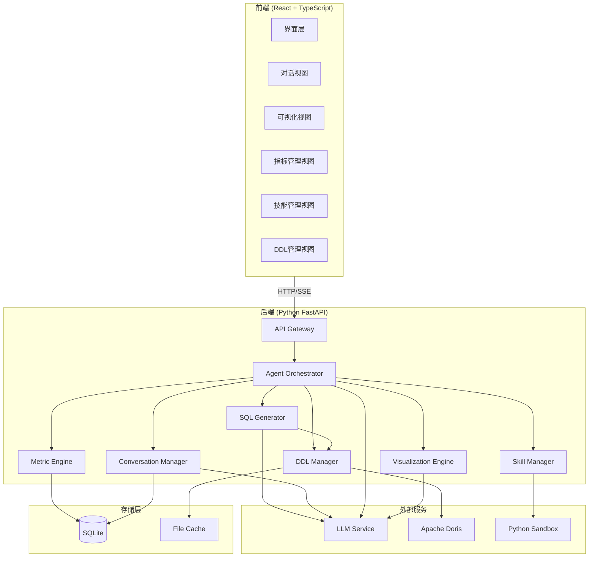
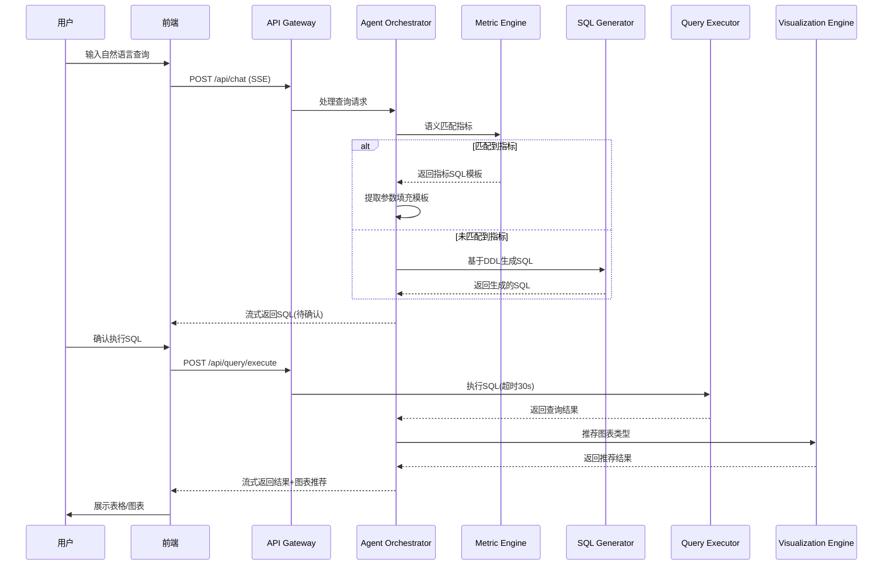
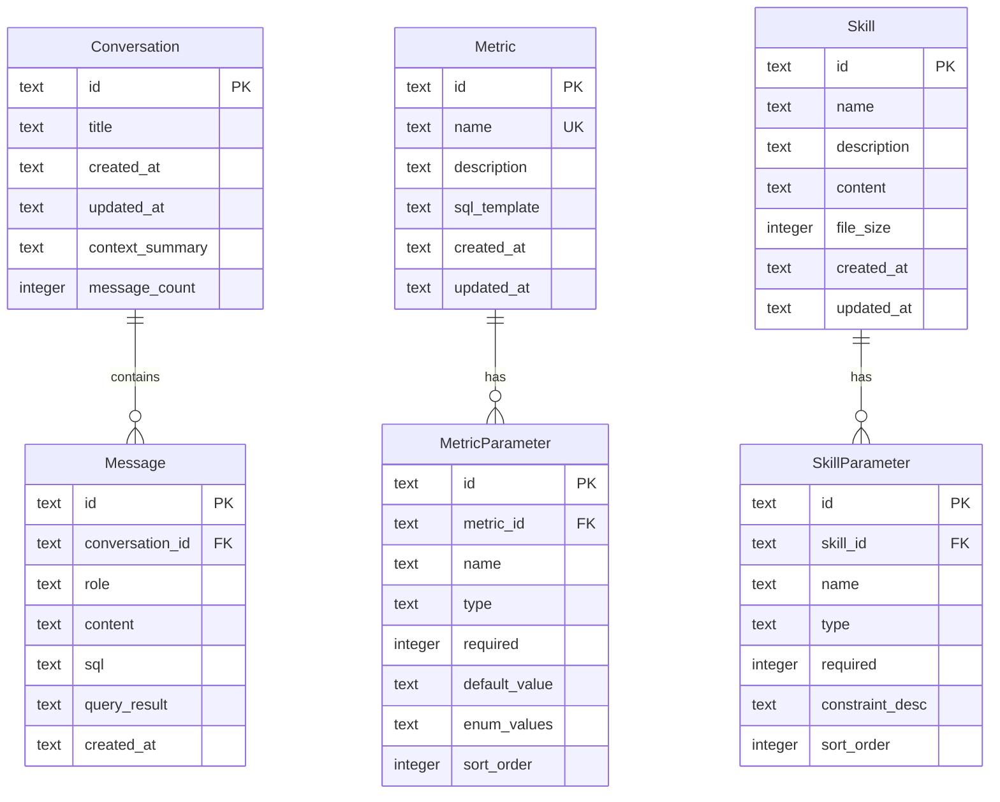
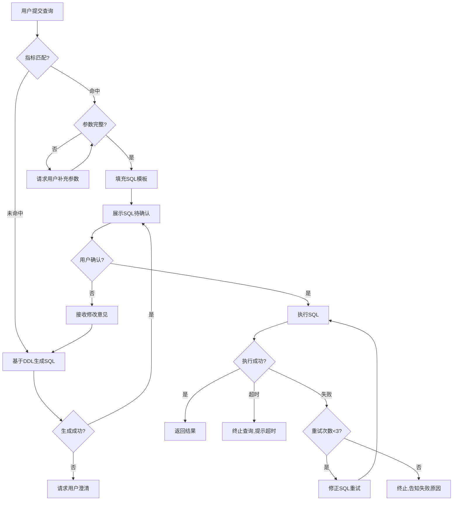

# Design Document: Doris Data Agent

## Overview

数仓智能体（Doris Data Agent）是一个基于大语言模型的智能数据查询与分析平台。系统采用前后端分离架构，前端提供深色主题的现代化交互界面，后端通过Agent编排层协调SQL生成、指标匹配、对话管理、可视化推荐等核心模块，最终连接Apache Doris数据仓库执行查询。

核心设计理念：
- **指标优先**：用户查询优先匹配预定义指标，未命中时回退到DDL驱动的SQL生成
- **上下文感知**：多轮对话中保持完整上下文，支持追问、质疑和深入分析
- **安全执行**：SQL确认机制、查询超时控制、沙箱环境执行脚本
- **智能可视化**：根据数据结构自动推荐最佳图表类型

## Architecture

### 系统架构图



### 技术选型

| 层级 | 技术 | 说明 |
|------|------|------|
| 前端框架 | React 18 + TypeScript | 现代化SPA，类型安全 |
| UI组件库 | Ant Design 5 | 支持深色主题，企业级组件 |
| 图表库 | ECharts 5 | 丰富的图表类型，交互能力强 |
| SQL编辑器 | Monaco Editor | VS Code同款编辑器，SQL语法高亮 |
| 后端框架 | Python FastAPI | 异步支持，SSE流式输出 |
| LLM集成 | OpenAI API Compatible | 支持多种LLM提供商 |
| 数据库 | SQLite | 文件数据库，存储对话、指标、技能等元数据 |
| 缓存 | 文件缓存（JSON文件） | DDL缓存、会话状态缓存，通过写文件实现 |
| 数据仓库 | Apache Doris | 目标查询引擎，MySQL协议兼容 |
| 沙箱 | Docker + RestrictedPython | 安全执行Python脚本 |

### 存储方案说明

- **SQLite**：轻量级文件数据库，无需独立数据库服务，适合单机部署。所有元数据（对话、指标、技能等）存储在单个 `.db` 文件中。
- **文件缓存**：DDL缓存和会话状态通过JSON文件持久化到本地文件系统的 `cache/` 目录下，按功能分子目录存储（如 `cache/ddl/`、`cache/session/`）。读写通过文件I/O实现，无需额外缓存服务。

### 请求处理流程



## Components and Interfaces

### 1. Agent Orchestrator（智能体编排器）

核心协调模块，负责理解用户意图、路由请求到各子系统、管理执行流程。

```typescript
interface AgentOrchestrator {
  // 处理用户查询，返回SSE流
  processQuery(request: QueryRequest): AsyncGenerator<StreamEvent>;
  // 处理SQL确认/拒绝
  handleSQLConfirmation(sessionId: string, confirmed: boolean, feedback?: string): AsyncGenerator<StreamEvent>;
  // 处理SQL执行失败的重试
  retrySQLExecution(sessionId: string, errorInfo: SQLError): AsyncGenerator<StreamEvent>;
}

interface QueryRequest {
  sessionId: string;
  message: string;
  conversationId?: string;
}

interface StreamEvent {
  type: 'thinking' | 'sql_preview' | 'executing' | 'result' | 'chart_recommendation' | 'error' | 'clarification';
  data: any;
}
```

### 2. SQL Generator（SQL生成器）

基于LLM和DDL上下文生成Doris SQL语句。

```typescript
interface SQLGenerator {
  // 根据自然语言和上下文生成SQL
  generateSQL(params: SQLGenParams): Promise<SQLGenResult>;
  // 根据用户反馈修正SQL
  refineSQLWithFeedback(originalSQL: string, feedback: string, context: ConversationContext): Promise<SQLGenResult>;
  // 根据指标名称和用途自动生成参考SQL
  generateReferenceSQL(metricName: string, description: string, ddlContext: DDLInfo[]): Promise<string>;
}

interface SQLGenParams {
  userQuery: string;
  ddlContext: DDLInfo[];
  conversationHistory: Message[];
  previousSQL?: string;
}

interface SQLGenResult {
  sql: string;
  explanation: string;
  confidence: number;
  referencedTables: string[];
}
```

### 3. Metric Engine（指标引擎）

管理预定义指标，提供语义匹配能力。

```typescript
interface MetricEngine {
  // CRUD操作
  createMetric(metric: MetricCreateInput): Promise<Metric>;
  updateMetric(id: string, updates: MetricUpdateInput): Promise<Metric>;
  deleteMetric(id: string): Promise<void>;
  listMetrics(pagination: PaginationParams): Promise<PaginatedResult<Metric>>;
  getMetric(id: string): Promise<Metric>;
  
  // 语义匹配
  matchMetric(query: string, threshold?: number): Promise<MetricMatchResult | null>;
  // 参数提取
  extractParameters(query: string, metric: Metric): Promise<ParameterValues>;
}

interface MetricMatchResult {
  metric: Metric;
  similarity: number;
  candidates: Array<{ metric: Metric; similarity: number }>;
}

interface MetricCreateInput {
  name: string;          // 最长64字符，系统内唯一
  description: string;   // 最长512字符
  sqlTemplate: string;
  parameters: MetricParameter[];  // 最多20个
}

interface MetricParameter {
  name: string;
  type: 'string' | 'number' | 'date' | 'enum';
  required: boolean;
  defaultValue?: any;
  enumValues?: string[];
}
```

### 4. Query Executor（查询执行器）

负责SQL执行、超时控制和结果处理。

```typescript
interface QueryExecutor {
  // 执行SQL，支持超时控制
  executeSQL(sql: string, options?: ExecuteOptions): Promise<QueryResult>;
  // 取消正在执行的查询
  cancelQuery(queryId: string): Promise<void>;
}

interface ExecuteOptions {
  timeout: number;       // 默认30000ms
  maxRows: number;       // 默认1000
  queryId?: string;
}

interface QueryResult {
  columns: ColumnInfo[];
  rows: any[][];
  rowCount: number;
  executionTime: number;
  truncated: boolean;    // 是否因maxRows截断
}

interface ColumnInfo {
  name: string;
  type: string;
  isNumeric: boolean;
  isDateTime: boolean;
}
```

### 5. Conversation Manager（对话管理器）

管理多轮对话上下文、历史持久化和搜索。

```typescript
interface ConversationManager {
  // 会话管理
  createConversation(title?: string): Promise<Conversation>;
  getConversation(id: string): Promise<Conversation>;
  deleteConversation(id: string): Promise<void>;
  listConversations(params: ConvListParams): Promise<PaginatedResult<ConversationSummary>>;
  searchConversations(params: ConvSearchParams): Promise<ConversationSummary[]>;
  
  // 消息管理
  addMessage(conversationId: string, message: MessageInput): Promise<Message>;
  getMessages(conversationId: string): Promise<Message[]>;
  
  // 上下文管理
  getContext(conversationId: string): Promise<ConversationContext>;
  summarizeContext(conversationId: string): Promise<ContextSummary>;
}

interface ConvListParams {
  page: number;
  pageSize: number;  // 最大20
  sortBy: 'updatedAt';
  order: 'desc';
}

interface ConvSearchParams {
  keyword?: string;
  startTime?: Date;
  endTime?: Date;
  limit: number;  // 最大50
}

interface ConversationContext {
  messages: Message[];
  summary?: ContextSummary;
  referencedTables: string[];
  referencedMetrics: string[];
}

interface ContextSummary {
  tables: string[];
  metrics: string[];
  filters: string[];
  keyValues: Record<string, any>;
  turnCount: number;
}
```

### 6. Visualization Engine（可视化引擎）

根据数据结构推荐图表类型，管理图表渲染配置。

```typescript
interface VisualizationEngine {
  // 推荐图表类型
  recommendChartType(queryResult: QueryResult): ChartRecommendation;
  // 生成图表配置
  generateChartConfig(queryResult: QueryResult, chartType: ChartType): ChartConfig;
  // 验证数据与图表类型兼容性
  validateCompatibility(queryResult: QueryResult, chartType: ChartType): CompatibilityResult;
}

type ChartType = 'table' | 'bar' | 'line' | 'pie';

interface ChartRecommendation {
  recommended: ChartType;
  reason: string;
  alternatives: ChartType[];
}

interface CompatibilityResult {
  compatible: boolean;
  warnings: string[];  // 不兼容时的适配建议
}

interface ChartConfig {
  type: ChartType;
  xAxis?: AxisConfig;
  yAxis?: AxisConfig;
  series: SeriesConfig[];
  legend?: LegendConfig;
  tooltip?: TooltipConfig;
}
```

### 7. Skill Manager（技能管理器）

管理分析技能的导入、执行和生命周期。

```typescript
interface SkillManager {
  // CRUD操作
  importSkill(file: SkillFile): Promise<Skill>;
  exportSkill(id: string): Promise<SkillFile>;
  updateSkill(id: string, updates: SkillUpdateInput): Promise<Skill>;
  deleteSkill(id: string): Promise<void>;
  listSkills(): Promise<Skill[]>;
  getSkill(id: string): Promise<Skill>;
  
  // 执行
  executeSkill(id: string, params: Record<string, any>): Promise<SkillExecutionResult>;
  // 参数校验
  validateParams(skill: Skill, params: Record<string, any>): ValidationResult;
}

interface SkillFile {
  name: string;
  content: string;     // 最大1MB
  format: 'claude-skill';
}

interface SkillExecutionResult {
  success: boolean;
  output: any;
  executionTime: number;
  hasData: boolean;
  data?: QueryResult;
}
```

### 8. DDL Manager（DDL管理器）

管理数据库表结构信息的加载、文件缓存和更新。

```typescript
interface DDLManager {
  // 加载DDL
  loadDDL(params: DDLLoadParams): Promise<DDLInfo[]>;
  // 刷新已加载的DDL
  refreshDDL(tableIds?: string[]): Promise<DDLInfo[]>;
  // 查询已加载的DDL（从文件缓存读取）
  listLoadedDDL(params?: DDLFilterParams): Promise<DDLInfo[]>;
  // 获取指定表的DDL（从文件缓存读取）
  getDDLByTable(database: string, table: string): Promise<DDLInfo | null>;
  // 检查表是否已加载（检查缓存文件是否存在）
  isTableLoaded(database: string, table: string): boolean;
  // 清除缓存文件
  clearCache(database?: string, table?: string): Promise<void>;
}

interface DDLLoadParams {
  database: string;
  tables?: string[];  // 为空则加载整个数据库
}

interface DDLFilterParams {
  database?: string;
  tableName?: string;
}

interface DDLInfo {
  id: string;
  database: string;
  tableName: string;
  ddlContent: string;
  columns: ColumnDefinition[];
  fieldCount: number;
  loadedAt: Date;
}

interface ColumnDefinition {
  name: string;
  type: string;
  nullable: boolean;
  comment?: string;
  isPrimaryKey: boolean;
}
```

## Data Models

### 数据库ER图（SQLite）



> **注意**：DDL缓存数据不存储在SQLite中，而是以JSON文件形式存储在文件系统中（详见下方DDLCache说明）。

### 核心数据模型定义

#### Conversation（会话）

| 字段 | 类型 | 约束 | 说明 |
|------|------|------|------|
| id | TEXT | PK | 会话唯一标识（UUID字符串） |
| title | TEXT | NOT NULL | 会话标题，首次对话自动生成 |
| created_at | TEXT | NOT NULL | 创建时间（ISO 8601格式） |
| updated_at | TEXT | NOT NULL | 最后活跃时间（ISO 8601格式） |
| context_summary | TEXT | NULLABLE | 上下文摘要（超出窗口时生成） |
| message_count | INTEGER | NOT NULL, DEFAULT 0 | 消息总数 |

#### Message（消息）

| 字段 | 类型 | 约束 | 说明 |
|------|------|------|------|
| id | TEXT | PK | 消息唯一标识（UUID字符串） |
| conversation_id | TEXT | FK, NOT NULL | 所属会话 |
| role | TEXT | NOT NULL | 消息角色（'user' 或 'agent'） |
| content | TEXT | NOT NULL | 消息文本内容 |
| sql | TEXT | NULLABLE | 关联的SQL语句 |
| query_result | TEXT | NULLABLE | 查询结果（JSON字符串） |
| created_at | TEXT | NOT NULL | 创建时间（ISO 8601格式） |

#### Metric（指标）

| 字段 | 类型 | 约束 | 说明 |
|------|------|------|------|
| id | TEXT | PK | 指标唯一标识（UUID字符串） |
| name | TEXT | UNIQUE, NOT NULL | 指标名称，系统内唯一（最长64字符） |
| description | TEXT | NOT NULL | 用途说明（最长512字符） |
| sql_template | TEXT | NOT NULL | SQL模板 |
| created_at | TEXT | NOT NULL | 创建时间（ISO 8601格式） |
| updated_at | TEXT | NOT NULL | 更新时间（ISO 8601格式） |

#### MetricParameter（指标参数）

| 字段 | 类型 | 约束 | 说明 |
|------|------|------|------|
| id | TEXT | PK | 参数唯一标识（UUID字符串） |
| metric_id | TEXT | FK, NOT NULL | 所属指标 |
| name | TEXT | NOT NULL | 参数名称（最长64字符） |
| type | TEXT | NOT NULL | 参数类型（'string'/'number'/'date'/'enum'） |
| required | INTEGER | NOT NULL, DEFAULT 1 | 是否必填（0/1） |
| default_value | TEXT | NULLABLE | 默认值 |
| enum_values | TEXT | NULLABLE | 枚举可选值列表（JSON字符串） |
| sort_order | INTEGER | NOT NULL | 排序序号 |

#### Skill（技能）

| 字段 | 类型 | 约束 | 说明 |
|------|------|------|------|
| id | TEXT | PK | 技能唯一标识（UUID字符串） |
| name | TEXT | NOT NULL | 技能名称（最长128字符） |
| description | TEXT | NULLABLE | 技能描述 |
| content | TEXT | NOT NULL | 技能文件内容（≤1MB） |
| file_size | INTEGER | NOT NULL | 文件大小（字节） |
| created_at | TEXT | NOT NULL | 创建时间（ISO 8601格式） |
| updated_at | TEXT | NOT NULL | 更新时间（ISO 8601格式） |

#### DDLCache（DDL缓存 - 文件存储）

DDL缓存不再存储在数据库中，而是以JSON文件形式存储在 `cache/ddl/` 目录下。每个数据库对应一个子目录，每张表对应一个JSON文件。

**文件路径格式**: `cache/ddl/{database_name}/{table_name}.json`

**JSON文件结构**:

| 字段 | 类型 | 说明 |
|------|------|------|
| database_name | string | 数据库名 |
| table_name | string | 表名 |
| ddl_content | string | 完整DDL语句 |
| field_count | number | 字段数量 |
| loaded_at | string | 加载时间（ISO 8601格式） |
| columns | array | 列定义数组 |

**columns数组元素结构**:

| 字段 | 类型 | 说明 |
|------|------|------|
| name | string | 列名 |
| type | string | 列类型 |
| nullable | boolean | 是否可空 |
| comment | string | 注释（可选） |
| is_primary_key | boolean | 是否主键 |

## Correctness Properties

*A property is a characteristic or behavior that should hold true across all valid executions of a system—essentially, a formal statement about what the system should do. Properties serve as the bridge between human-readable specifications and machine-verifiable correctness guarantees.*

### Property 1: SQL引用验证

*For any* 生成的SQL语句和提供的DDL上下文，SQL中引用的所有表名和列名必须存在于DDL上下文中定义的表结构里。

**Validates: Requirements 1.1**

### Property 2: 查询结果行数限制

*For any* 查询执行结果，返回的数据行数不超过1000行；当原始结果超过1000行时，truncated标志必须为true。

**Validates: Requirements 1.2, 5.1**

### Property 3: SQL重试机制上限

*For any* SQL执行失败序列，重试次数不超过3次；若在重试过程中某次执行成功则立即返回结果，若3次重试均失败则终止并返回错误。

**Validates: Requirements 1.4**

### Property 4: 指标创建验证

*For any* 指标创建请求，若指标名称超过64个字符、用途说明超过512个字符、指标名称与已有指标重复、或参数数量超过20个，则创建操作必须被拒绝并返回对应的验证错误。

**Validates: Requirements 2.2, 2.6**

### Property 5: 指标语义匹配

*For any* 用户查询和指标集合，匹配函数应返回语义相似度最高且超过阈值的指标；若所有指标的相似度均未达到阈值，则返回null。

**Validates: Requirements 2.3, 2.4**

### Property 6: 缺失指标参数检测

*For any* 指标参数定义集合和从用户查询中提取的参数值，若存在必填参数既未被提取到也未配置默认值，则系统必须返回所有缺失参数的名称列表。

**Validates: Requirements 2.9**

### Property 7: 上下文摘要信息保留

*For any* 对话上下文执行摘要压缩后，摘要中必须包含原始对话中涉及的所有表名、指标名称、筛选条件和关键数值。

**Validates: Requirements 3.5**

### Property 8: 会话消息轮次上限

*For any* 会话，活跃（未被摘要压缩的）消息轮次数不超过50轮；当添加第51轮消息时，最早的消息轮次必须被执行摘要压缩。

**Validates: Requirements 3.7**

### Property 9: 会话列表分页排序

*For any* 会话列表查询请求，返回结果必须按最后活跃时间降序排列，且单页返回数量不超过20条。

**Validates: Requirements 4.2**

### Property 10: 会话搜索结果限制

*For any* 会话搜索请求（含关键词和/或时间范围），返回结果必须匹配搜索条件、按时间降序排列、且总数不超过50条。

**Validates: Requirements 4.4**

### Property 11: 图表类型推荐规则

*For any* 查询结果数据，若包含时间序列维度和数值度量则推荐折线图；若仅包含分类维度和数值度量则推荐柱状图；推荐结果必须与数据的维度类型一致。

**Validates: Requirements 5.4, 5.5**

### Property 12: 图表数据兼容性验证

*For any* 图表类型和查询结果数据的组合，若数据结构不满足该图表类型的最低要求（饼图需要分类维度+数值度量、折线图需要有序维度+数值度量、柱状图需要分类维度+数值度量），兼容性检查必须返回compatible=false并附带具体的不匹配说明。

**Validates: Requirements 5.8**

### Property 13: 技能导入验证

*For any* 技能导入文件，若文件大小超过1MB则拒绝导入；若文件内容不符合Claude Code skill格式规范则拒绝导入并返回具体的格式错误描述。

**Validates: Requirements 7.1, 7.6**

### Property 14: 技能参数类型校验

*For any* 技能参数定义和用户提供的参数值，若参数值不符合定义的类型约束（如类型不匹配、超出范围），校验函数必须返回失败并指明具体的参数校验错误。

**Validates: Requirements 7.9**

### Property 15: DDL选择性加载过滤

*For any* DDL加载请求中指定的数据库名和表名过滤条件，加载结果中的每一条DDL记录必须匹配指定的过滤条件。

**Validates: Requirements 8.4**

### Property 16: 未加载表检测

*For any* SQL语句中引用的表名集合和当前已加载的DDL缓存，若存在引用的表不在缓存中，检测函数必须返回所有未加载的表名列表。

**Validates: Requirements 8.5**

### Property 17: DDL缓存文件错误保护

*For any* DDL加载操作，若操作过程中发生错误（连接失败、获取异常），操作结束后的DDL缓存文件状态必须与操作开始前完全一致。

**Validates: Requirements 8.6**

## Error Handling

### 错误分类与处理策略

| 错误类别 | 触发条件 | 处理策略 | 用户反馈 |
|----------|----------|----------|----------|
| SQL生成失败 | LLM无法生成有效SQL | 请求用户澄清查询意图 | 提示无法理解并请求补充信息 |
| SQL执行失败 | Doris返回错误 | 自动重试最多3次，每次修正SQL | 展示错误原因，重试失败后告知终止 |
| 查询超时 | 执行超过30秒 | 终止查询，释放连接 | 提示查询超时，建议优化查询条件 |
| 指标匹配失败 | 无指标达到阈值 | 回退到DDL驱动SQL生成 | 透明处理，无需额外提示 |
| 参数提取失败 | 必填参数缺失 | 向用户请求补充参数 | 列出缺失参数名称 |
| DDL加载失败 | Doris连接异常 | 终止加载，保留现有缓存文件 | 展示连接错误信息 |
| 技能执行超时 | Python脚本超过30秒 | 终止沙箱进程 | 展示超时错误 |
| 技能执行异常 | Python运行时错误 | 捕获异常，终止执行 | 展示异常类型和信息 |
| 上下文溢出 | 对话超出模型窗口 | 自动摘要压缩早期对话 | 透明处理 |
| 文件格式错误 | 技能文件不合规范 | 拒绝导入 | 提示具体格式错误 |

### 错误处理流程



### 全局错误处理原则

1. **优雅降级**：外部服务不可用时，系统核心功能保持可用（如Doris断连时仍可浏览历史对话）
2. **错误隔离**：单个模块的错误不应导致整个系统崩溃
3. **用户友好**：所有错误信息以用户可理解的方式呈现，避免暴露技术细节
4. **可恢复性**：提供明确的恢复路径（重试、修改输入、切换方式）
5. **日志记录**：所有错误记录详细日志（含堆栈、上下文），便于排查

## Testing Strategy

### 测试方法概述

本项目采用双轨测试策略：

- **属性测试（Property-Based Testing）**：验证系统在所有有效输入下的通用正确性属性
- **单元测试（Unit Testing）**：验证具体示例、边界条件和错误处理
- **集成测试（Integration Testing）**：验证模块间协作和外部服务交互

### 属性测试配置

- **测试库**：Hypothesis（Python后端）/ fast-check（TypeScript前端）
- **最小迭代次数**：每个属性测试至少100次迭代
- **标签格式**：`Feature: doris-data-agent, Property {number}: {property_text}`

### 属性测试覆盖范围

| Property | 测试目标 | 生成器策略 |
|----------|----------|------------|
| P1 | SQL引用验证 | 生成随机DDL Schema + SQL AST |
| P2 | 行数限制 | 生成随机行数(0-10000)的结果集 |
| P3 | 重试机制 | 生成随机成功/失败序列 |
| P4 | 指标创建验证 | 生成随机长度字符串和参数列表 |
| P5 | 语义匹配 | 生成随机相似度分数集合 |
| P6 | 缺失参数检测 | 生成随机参数定义和提取结果 |
| P7 | 摘要信息保留 | 生成含随机表名/指标/条件的对话 |
| P8 | 消息轮次上限 | 生成随机长度的消息序列 |
| P9 | 列表分页排序 | 生成随机时间戳的会话集合 |
| P10 | 搜索结果限制 | 生成随机会话数据和搜索条件 |
| P11 | 图表推荐 | 生成随机列类型组合的结果集 |
| P12 | 兼容性验证 | 生成随机图表类型+数据结构组合 |
| P13 | 技能导入验证 | 生成随机大小和格式的文件内容 |
| P14 | 参数类型校验 | 生成随机类型定义和参数值 |
| P15 | DDL加载过滤 | 生成随机DDL集合和过滤条件 |
| P16 | 未加载表检测 | 生成随机表引用和缓存状态 |
| P17 | 缓存错误保护 | 生成随机缓存文件状态+模拟错误 |

### 单元测试覆盖范围

| 模块 | 测试重点 | 示例场景 |
|------|----------|----------|
| SQL Generator | SQL确认/拒绝流程 | 用户确认执行、用户拒绝并提供反馈 |
| Query Executor | 超时处理 | 30秒超时触发取消 |
| Metric Engine | CRUD操作 | 创建/编辑/删除/查询指标 |
| Conversation Manager | 会话删除 | 删除后数据完全清除 |
| Visualization Engine | 图表类型支持 | 四种图表类型均可渲染 |
| Skill Manager | 执行超时/异常 | 30秒超时终止、运行时异常捕获 |
| DDL Manager | 表结构展示 | 列表正确展示已加载DDL |

### 集成测试覆盖范围

| 测试场景 | 验证目标 |
|----------|----------|
| 端到端查询流程 | 自然语言→SQL生成→确认→执行→可视化 |
| 指标匹配回退 | 匹配失败时正确回退到DDL生成 |
| 多轮对话上下文 | 追问时正确引用历史SQL和结果 |
| SSE流式输出 | 事件按正确顺序逐步推送 |
| Doris连接管理 | 连接池、超时、断连恢复 |
| 沙箱安全隔离 | 网络访问禁止、文件写入禁止、内存限制 |
| DDL刷新 | 刷新后缓存文件与数据库一致 |

### 测试环境

- **单元测试/属性测试**：本地运行，Mock外部依赖（LLM、Doris）
- **集成测试**：Docker Compose环境，包含Doris实例；SQLite和文件缓存直接使用临时目录
- **E2E测试**：Playwright驱动浏览器，验证完整用户流程
