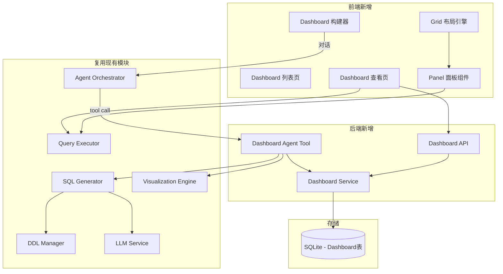
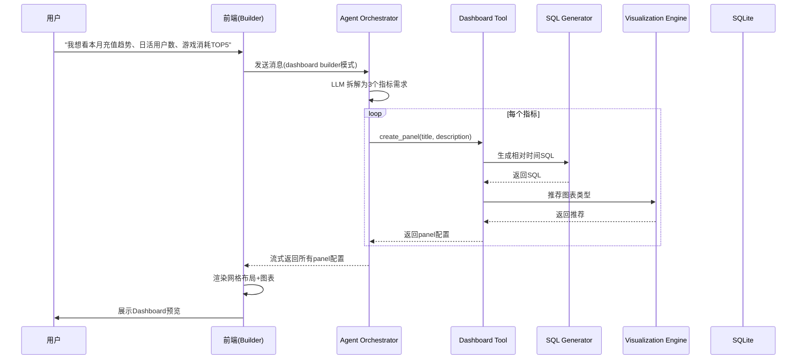
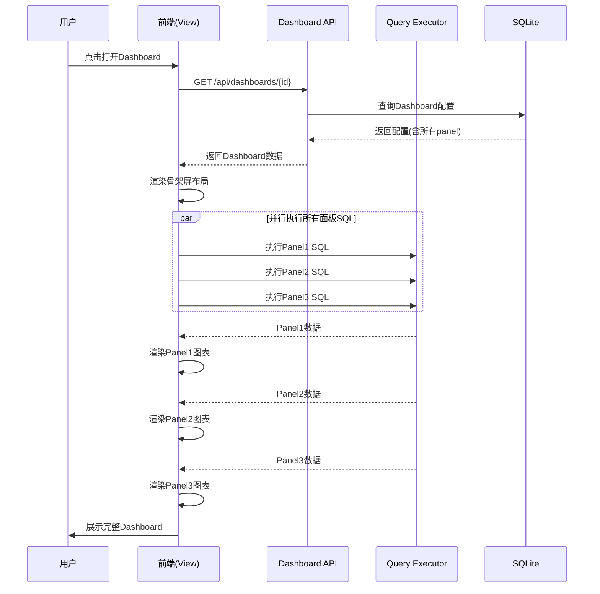
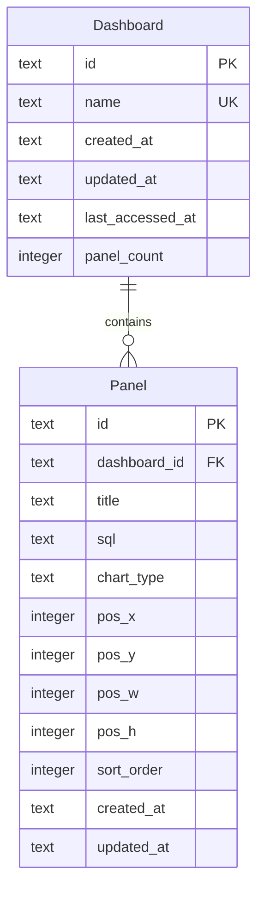

# Design Document: Smart Dashboard（智能大屏）

## Overview

智能大屏模块扩展现有数仓智能体平台，提供对话式数据看板构建能力。用户通过自然语言描述指标需求，系统自动拆解为多个数据面板，生成相对时间 SQL 并推荐图表类型。面板以可拖拽网格布局渲染，用户可交互调整后持久化保存。已保存的 Dashboard 可随时打开，自动执行 SQL 获取最新数据。

核心设计理念：
- **对话驱动**：复用现有 Agent 能力，通过新增 tool 实现面板的创建/修改/删除
- **相对时间 SQL**：所有面板 SQL 使用相对时间函数，确保每次打开获取最新数据
- **面板独立性**：每个面板独立执行查询，单面板失败不影响整体
- **渐进式构建**：支持对话中逐步添加、修改、删除面板

## Architecture

### 模块架构图



### 技术选型（新增部分）

| 层级 | 技术 | 说明 |
|------|------|------|
| 前端布局 | react-grid-layout | 成熟的 React 网格拖拽布局库，支持响应式 |
| 数据存储 | SQLite（复用现有） | Dashboard 和 Panel 元数据存储 |
| Agent Tool | LangChain Tool | 新增 dashboard 相关 tool 供 Agent 调用 |

### 核心流程

#### 流程1：对话式创建 Dashboard



#### 流程2：打开已保存的 Dashboard



## Components and Interfaces

### 1. Dashboard Service（后端服务）

管理 Dashboard 的 CRUD 和面板配置。

```typescript
interface DashboardService {
  // Dashboard CRUD
  createDashboard(input: DashboardCreateInput): Promise<Dashboard>;
  getDashboard(id: string): Promise<Dashboard>;
  updateDashboard(id: string, input: DashboardUpdateInput): Promise<Dashboard>;
  deleteDashboard(id: string): Promise<void>;
  listDashboards(params: DashboardListParams): Promise<PaginatedResult<DashboardSummary>>;
  
  // Panel 管理
  addPanel(dashboardId: string, panel: PanelCreateInput): Promise<Panel>;
  updatePanel(dashboardId: string, panelId: string, input: PanelUpdateInput): Promise<Panel>;
  removePanel(dashboardId: string, panelId: string): Promise<void>;
  
  // 布局更新
  updateLayout(dashboardId: string, layout: LayoutItem[]): Promise<void>;
}

interface DashboardCreateInput {
  name: string;           // ≤64字符，系统内唯一
  panels?: PanelCreateInput[];
}

interface PanelCreateInput {
  title: string;
  sql: string;
  chartType: ChartType;
  position: LayoutPosition;
}

interface LayoutPosition {
  x: number;   // 网格列位置 (0-11)
  y: number;   // 网格行位置
  w: number;   // 宽度(列数, 最小3)
  h: number;   // 高度(行数, 最小2)
}
```

### 2. Dashboard Agent Tool（Agent 工具）

供 Agent Orchestrator 在对话中调用，实现面板的创建/修改/删除。

```typescript
interface DashboardAgentTool {
  // 创建面板：LLM 调用此 tool 为用户创建一个数据面板
  create_panel(params: {
    title: string;
    description: string;  // 指标描述，用于生成SQL
    chart_type?: string;  // 可选，用户指定的图表类型
  }): Promise<PanelResult>;
  
  // 修改面板：根据用户反馈修改已有面板
  update_panel(params: {
    panel_id: string;
    description?: string;  // 新的指标描述
    title?: string;
    chart_type?: string;
  }): Promise<PanelResult>;
  
  // 删除面板
  remove_panel(params: {
    panel_id: string;
  }): Promise<{ success: boolean }>;
}

interface PanelResult {
  panel_id: string;
  title: string;
  sql: string;
  chart_type: string;
  position: LayoutPosition;
}
```

### 3. Dashboard API（HTTP 接口）

```typescript
// Dashboard CRUD
POST   /api/dashboards              // 创建 Dashboard
GET    /api/dashboards              // 列表查询
GET    /api/dashboards/{id}         // 获取详情（含所有panel配置）
PUT    /api/dashboards/{id}         // 更新 Dashboard（名称、面板、布局）
DELETE /api/dashboards/{id}         // 删除 Dashboard

// Panel 数据执行
POST   /api/dashboards/{id}/panels/{panelId}/execute  // 执行单个面板SQL
POST   /api/dashboards/{id}/execute-all               // 执行所有面板SQL
```

### 4. 前端组件

```typescript
// Dashboard 列表页
interface DashboardListPage {
  // 展示所有已保存的Dashboard
  // 提供新建入口
  // 支持删除和重命名
}

// Dashboard 查看/编辑页
interface DashboardViewPage {
  // 渲染网格布局
  // 支持编辑模式切换
  // 全局刷新
  // 保存操作
}

// Dashboard 构建器（对话模式）
interface DashboardBuilder {
  // 对话输入区
  // 实时预览区（网格布局）
  // 面板生成后即时渲染
}

// Panel 面板组件
interface PanelComponent {
  // 图表渲染（复用 ChartView）
  // 操作栏：图表切换、刷新、编辑标题、删除
  // 加载状态/错误状态
  // 最近刷新时间
}
```

## Data Models

### 数据库 ER 图（新增表）



### Dashboard（大屏）

| 字段 | 类型 | 约束 | 说明 |
|------|------|------|------|
| id | TEXT | PK | Dashboard 唯一标识（UUID） |
| name | TEXT | UNIQUE, NOT NULL | 大屏名称（≤64字符） |
| created_at | TEXT | NOT NULL | 创建时间（ISO 8601） |
| updated_at | TEXT | NOT NULL | 最后修改时间（ISO 8601） |
| last_accessed_at | TEXT | NOT NULL | 最近访问时间（ISO 8601） |
| panel_count | INTEGER | NOT NULL, DEFAULT 0 | 面板数量（≤12） |

### Panel（面板）

| 字段 | 类型 | 约束 | 说明 |
|------|------|------|------|
| id | TEXT | PK | 面板唯一标识（UUID） |
| dashboard_id | TEXT | FK, NOT NULL | 所属 Dashboard |
| title | TEXT | NOT NULL | 面板标题 |
| sql | TEXT | NOT NULL | 查询 SQL（使用相对时间） |
| chart_type | TEXT | NOT NULL | 图表类型（table/bar/line/pie） |
| pos_x | INTEGER | NOT NULL | 网格 X 位置（0-11） |
| pos_y | INTEGER | NOT NULL | 网格 Y 位置 |
| pos_w | INTEGER | NOT NULL | 宽度列数（≥3） |
| pos_h | INTEGER | NOT NULL | 高度行数（≥2） |
| sort_order | INTEGER | NOT NULL | 排序序号 |
| created_at | TEXT | NOT NULL | 创建时间（ISO 8601） |
| updated_at | TEXT | NOT NULL | 更新时间（ISO 8601） |

## Correctness Properties

### Property 1: 相对时间 SQL 约束

*For any* Dashboard 面板中保存的 SQL 语句，若包含时间筛选条件，则时间条件必须使用相对时间函数（CURDATE、NOW、DATE_SUB、DATE_ADD、DATE_FORMAT 等），不得包含硬编码的日期字面量（如 '2024-01-01'）。

**Validates: Requirements 1.2**

### Property 2: 面板数量上限

*For any* Dashboard，其包含的面板数量不超过12个；当尝试添加第13个面板时，操作必须被拒绝。

**Validates: Requirements 3.8**

### Property 3: 面板布局约束

*For any* Panel 的布局配置，pos_x + pos_w ≤ 12（不超出网格宽度），pos_w ≥ 3（最小宽度），pos_h ≥ 2（最小高度）。

**Validates: Requirements 2.1, 2.8**

### Property 4: Dashboard 名称唯一性

*For any* Dashboard 创建或重命名操作，若目标名称已被其他 Dashboard 使用，则操作必须被拒绝并返回名称冲突错误。

**Validates: Requirements 3.2**

### Property 5: SQL 安全校验

*For any* 面板 SQL 执行请求，SQL 语句必须以 SELECT 开头（忽略前导空白和注释），包含 INSERT、UPDATE、DELETE、DROP、ALTER、CREATE、TRUNCATE 关键字的语句必须被拒绝。

**Validates: Requirements 4.7**

### Property 6: 面板独立性

*For any* Dashboard 数据加载过程，单个面板的 SQL 执行失败（超时、语法错误、表不存在等）不得影响其他面板的正常加载和渲染。

**Validates: Requirements 3.4, 4.1**

### Property 7: 布局无重叠

*For any* Dashboard 中的面板集合，任意两个面板的布局区域不得重叠（即不存在两个面板的矩形区域有交集）。

**Validates: Requirements 2.1, 2.2**

## Error Handling

### 错误分类与处理策略

| 错误类别 | 触发条件 | 处理策略 | 用户反馈 |
|----------|----------|----------|----------|
| 面板 SQL 执行失败 | Doris 返回错误 | 仅该面板显示错误，其他面板正常 | 面板内展示错误信息和重试按钮 |
| 面板 SQL 超时 | 执行超过30秒 | 终止该面板查询 | 面板内展示超时提示和重试按钮 |
| Dashboard 名称冲突 | 保存时名称已存在 | 拒绝保存 | 提示名称已被使用，请修改 |
| 面板数量超限 | 添加第13个面板 | 拒绝添加 | 提示已达上限，需删除后再添加 |
| SQL 安全校验失败 | SQL 包含写操作 | 拒绝执行 | 提示仅支持 SELECT 查询 |
| 表结构变更 | 保存的 SQL 引用的表/列已不存在 | 面板显示错误 | 提示表结构已变更，建议重新生成 |
| LLM 拆解失败 | 无法理解用户描述 | 请求用户补充说明 | 提示无法理解，请更具体描述 |

### 错误处理原则

1. **面板隔离**：单面板错误绝不影响其他面板和整体布局
2. **可恢复**：所有错误状态提供重试或重新生成入口
3. **数据安全**：仅允许 SELECT 查询，从源头防止数据篡改
4. **优雅降级**：SQL 执行失败时保留面板框架和标题，仅内容区显示错误

## Testing Strategy

### 属性测试

| Property | 测试目标 | 生成器策略 |
|----------|----------|------------|
| P1 | 相对时间 SQL | 生成含时间条件的随机 SQL，验证不含硬编码日期 |
| P2 | 面板数量上限 | 生成随机数量(0-20)的面板添加序列 |
| P3 | 布局约束 | 生成随机布局参数，验证约束检查 |
| P4 | 名称唯一性 | 生成随机名称集合，验证冲突检测 |
| P5 | SQL 安全校验 | 生成随机 SQL 语句（含 SELECT 和非 SELECT），验证校验逻辑 |
| P6 | 面板独立性 | 模拟随机面板失败组合，验证其他面板不受影响 |
| P7 | 布局无重叠 | 生成随机布局集合，验证无重叠 |

### 单元测试

| 模块 | 测试重点 |
|------|----------|
| Dashboard Service | CRUD 操作、面板数量限制、名称唯一性 |
| Dashboard Tool | SQL 生成包含相对时间、图表推荐正确性 |
| Panel Executor | 并行执行、超时处理、错误隔离 |
| Layout Engine | 布局约束验证、自动排列、无重叠检查 |

### 集成测试

| 场景 | 验证目标 |
|------|----------|
| 对话创建 Dashboard | 自然语言→面板拆解→SQL生成→渲染 |
| 打开已保存 Dashboard | 加载配置→并行执行SQL→渲染图表 |
| 面板失败隔离 | 模拟部分面板SQL失败，验证其他面板正常 |
| 布局拖拽保存 | 拖拽调整→保存→重新打开验证布局一致 |
