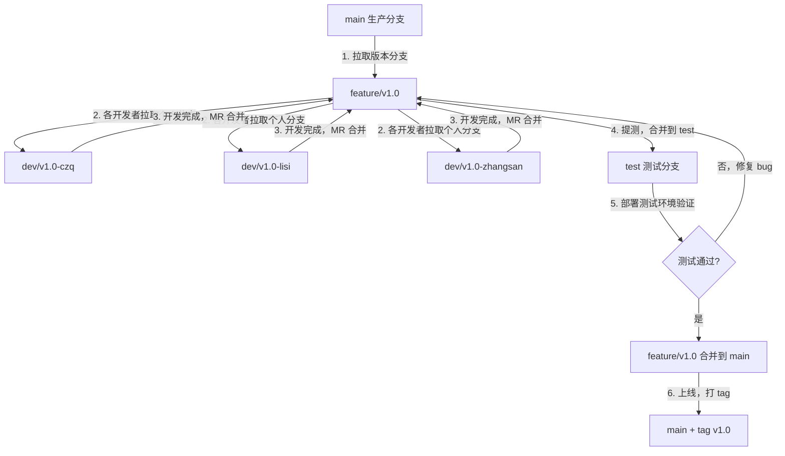
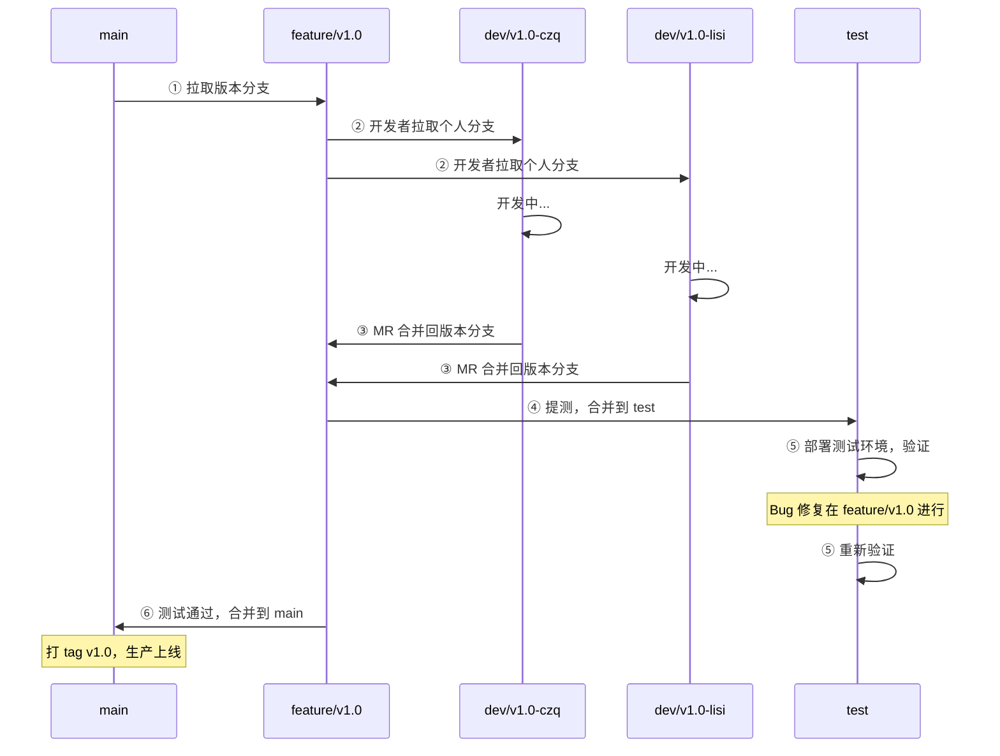
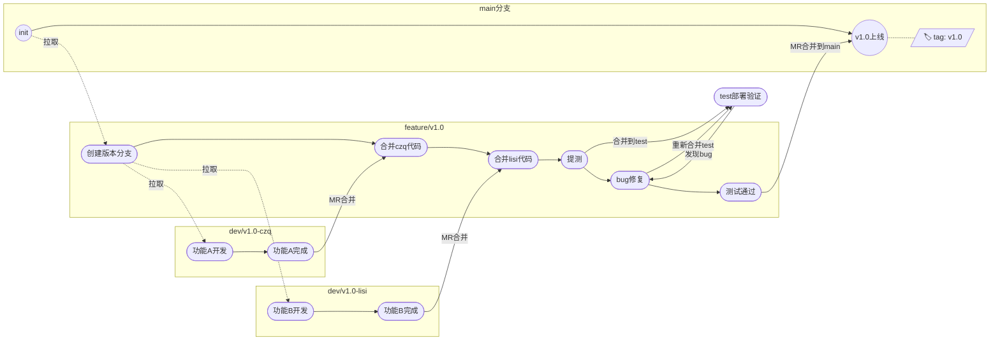

# GitLab Merge Request 流程与分支规范

## 一、分支模型

本项目采用四层分支保护策略：

| 分支模式 | 用途 | 合并权限 | 推送权限 | 强制推送 |
|---------|------|---------|---------|---------|
| `main` | 生产主分支（default） | Maintainers | Maintainers | ❌ |
| `test` | 测试环境部署分支 | Maintainers | Maintainers | ❌ |
| `feature/*` | 版本/功能开发分支 | Maintainers | Maintainers | ❌ |
| `dev/*` | 个人开发/联调分支 | Developers + Maintainers | Developers + Maintainers | ❌ |

## 二、分支命名规范

### 2.1 版本分支（feature）

```
feature/<版本号>
feature/<模块>-<简要描述>
```

示例：
- `feature/v1.0` — v1.0 版本开发
- `feature/v1.1` — v1.1 版本开发
- `feature/lineage-dag-visualization` — 血缘图 DAG 可视化

### 2.2 个人开发分支（dev）

```
dev/<版本号>-<开发者>
dev/<模块>-<开发者>
```

示例：
- `dev/v1.0-czq` — czq 在 v1.0 版本的个人分支
- `dev/v1.0-lisi` — lisi 在 v1.0 版本的个人分支
- `dev/v1.0-zhangsan` — zhangsan 在 v1.0 版本的个人分支

### 2.3 修复分支

```
fix/<issue编号或描述>
hotfix/<紧急修复描述>
```

示例：
- `fix/123-sql-injection` — 修复 #123 SQL 注入问题
- `hotfix/login-token-expired` — 紧急修复登录 token 过期

## 三、核心开发流程

### 3.1 流程图（Mermaid）



### 3.2 时序图（Mermaid）



### 3.3 分支生命周期图



## 四、详细操作步骤

### 4.1 创建版本分支（Maintainer 操作）

```bash
git checkout main
git pull origin main
git checkout -b feature/v1.0
git push -u origin feature/v1.0
```

### 4.2 开发者拉取个人分支

```bash
git fetch origin
git checkout feature/v1.0
git pull origin feature/v1.0
git checkout -b dev/v1.0-czq
git push -u origin dev/v1.0-czq
```

### 4.3 日常开发提交

```bash
# 开发并提交
git add .
git commit -m "feat(agent): 添加流式对话功能"

# 推送到远程
git push origin dev/v1.0-czq
```

### 4.4 合并回版本分支（MR）

```bash
# 合并前先同步版本分支最新代码
git checkout dev/v1.0-czq
git fetch origin
git rebase origin/feature/v1.0

# 解决冲突后推送
git push origin dev/v1.0-czq --force-with-lease
```

然后在 GitLab 创建 MR：
- Source: `dev/v1.0-czq`
- Target: `feature/v1.0`
- 指定 Reviewer 进行 Code Review

### 4.5 提测（合并到 test）

```bash
# Maintainer 操作
git checkout test
git pull origin test
git merge origin/feature/v1.0
git push origin test
```

或通过 GitLab MR：Source `feature/v1.0` → Target `test`

### 4.6 测试阶段 Bug 修复

```bash
# 在 feature/v1.0 上修复，不要直接改 test
git checkout feature/v1.0
git pull origin feature/v1.0
# 修复 bug...
git commit -m "fix(agent): 修复流式响应中断问题"
git push origin feature/v1.0

# 重新合并到 test 验证
git checkout test
git merge origin/feature/v1.0
git push origin test
```

### 4.7 上线（合并到 main）

通过 GitLab MR：
- Source: `feature/v1.0`
- Target: `main`
- Review + Approve 后合并

上线后打 tag：
```bash
git checkout main
git pull origin main
git tag -a v1.0 -m "Release v1.0: 版本描述"
git push origin v1.0
```

## 五、Merge Request 规范

### 5.1 MR 标题格式

```
<type>(<scope>): <简要描述>
```

### 5.2 MR 描述模板

```markdown
## 改动内容
- 具体改了什么

## 改动原因
- 为什么要改

## 测试方式
- 如何验证改动正确

## 关联 Issue
- #issue编号
```

## 六、Commit Message 规范

```
<type>(<scope>): <subject>
```

### Type 类型

| 类型 | 说明 |
|------|------|
| `feat` | 新功能 |
| `fix` | 修复 Bug |
| `refactor` | 重构（不影响功能） |
| `docs` | 文档变更 |
| `style` | 代码格式（不影响逻辑） |
| `perf` | 性能优化 |
| `test` | 测试相关 |
| `chore` | 构建/工具/依赖变更 |

### Scope 范围（基于项目模块）

| Scope | 对应目录/模块 |
|-------|-------------|
| `frontend` | frontend/ |
| `backend` | backend/ |
| `agent` | backend/app/services/agent_* |
| `lineage` | 血缘分析相关 |
| `chat` | 对话相关 |
| `skill` | 技能管理相关 |
| `query` | SQL 查询相关 |
| `ddl` | DDL 管理相关 |

### 示例

```
feat(lineage): 添加血缘 DAG 可视化页面
fix(agent): 修复流式响应中断问题
refactor(backend): 拆分 query_executor 为独立模块
docs(skill): 补充 business-analysis 技能说明
```

## 七、注意事项

1. **禁止直接推送 main / test**：所有变更必须通过 MR 合并
2. **test 是部署载体，不是代码归属地**：代码归属在 `feature/vX.X`，test 只用于触发测试环境部署
3. **Bug 修复在 feature 分支进行**：测试发现 bug 后在 `feature/vX.X` 修复，再合并到 test 重新验证
4. **dev 分支权限宽松**：开发者可直接推送，适合快速迭代
5. **合并前 rebase**：个人分支合并回版本分支前，先 rebase 最新版本分支代码
6. **上线后打 tag**：`feature/vX.X` 合并到 main 后，打对应版本 tag
7. **及时清理**：版本上线后删除对应的 feature 和 dev 分支
8. **test 分支定期重置**：如果 test 分支积累太多历史，可从 main 重新拉取
